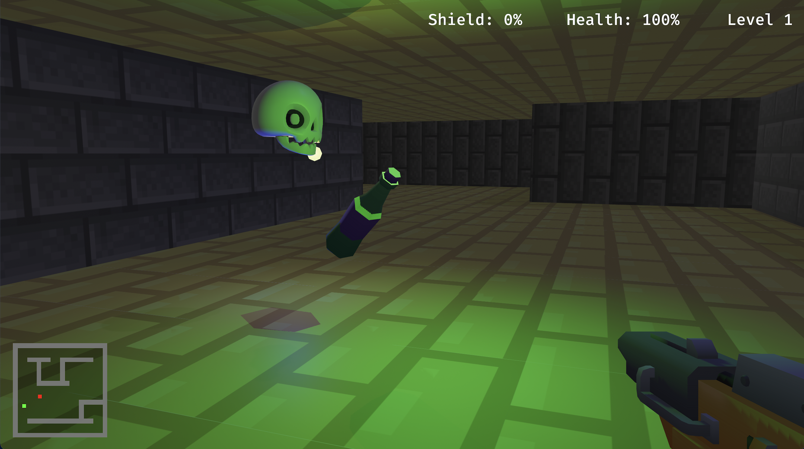
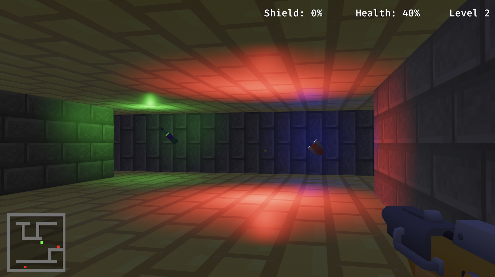

# FPS Game Prototype in Rust

An FPS game prototype built in Rust with Bevy.  
The project features a grid-based level, first-person movement, enemies, projectile combat, pickups, and a minimap UI.

## Features

- First-person movement and mouse look
- Grid-based walls/floor layout
- Enemy movement, line-of-sight shooting, and level progression
- Projectile effects and particle explosions
- Health and shield pickups
- On-screen HUD (health, shield, level) and minimap

## Screenshots




## Requirements

- Rust (stable)
- Cargo
- A GPU/driver setup compatible with Bevy/WGPU

Install Rust with [rustup](https://rustup.rs/) if needed.

## Running

```bash
cargo run
```

## Controls

- `S` - start game from title screen
- `W/A/S/D` or Arrow keys - move
- `Mouse` - look around
- `Space` - shoot
- `Esc` - release mouse cursor
- `Q` - quit
- `P` - restart after game over
- `S` (on level complete screen) - start next level

## Project Layout

- `src/main.rs` - core game logic, systems, and gameplay loop
- `assets/` - textures, models, and level data loaded at runtime
- `docs/images/` - README screenshots

## License

This project is licensed under the MIT License. See `LICENSE`.
